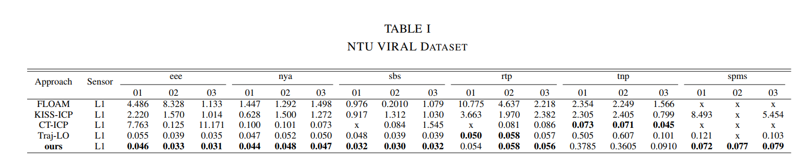

# AdaCt
We propose a straightforward and efficient continuous-time LiDAR odometry method based on linear interpolation, which can flexibly adjust the temporal intervals between control nodes according to the dynamics of motion and environmental degradation. The method reduces temporal interval through PCA(Principal Component Analysis) to judge the dynamics of motion, while increasing temporal interval during the optimization process to address degeneracy issues which caused by segmentation of LiDAR scans. For the map management, we use the multi-resolution voxelmap to get different scale plane features. 

# Dataset   Evalution

## NTU VIRAL DATASET

## M2DGR DATASET

# Thanks
 Thanks [ct-icp](https://github.com/jedeschaud/ct_icp) and [voxel_map](https://github.com/hku-mars/VoxelMap).

